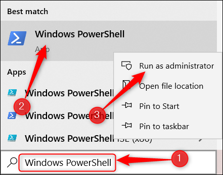

# Oficina sobre Docker

Objetivo: Um conteúdo prático sobre o que é Docker, como utilizar os comandos principais, Dockerfiles e docker-compose.

Os principais comandos utilizados ficarão salvos neste arquivo e poderão servir como uma "cola" para começar a montar seus próprios containers. 
Os Arquivos estarão disponíveis no [Github](https://github.com/Rede-DSBR/docker_oficina)
Este conteúdo foi escrito como parte de um 


# Conteúdo

1. [Introdução](#Introdução)
2. [Instalação](#Instalação)
3. [Hello Docker](#HelloDocker)
4. [Dockerfile](#Dockerfile)
5. [Docker-compose](#Docker-compose)
6. [Referências](#Referências)


<div id='Introdução'/>

# Introdução


## Porque isto acontece ?

* Versões diferentes do compilador/interpretador
* Bibliotecas não instaladas ou diferentes versões
* Bibliotecas de sistema (dll's)
* Variáveis de Ambiente
* 100% Multiplataforma (?)


Usa o Kernel do sistema base.

Forma rápida e confiável de subir uma aplicação em vários lugares da mesma maneira sem precisar de uma iso do sistema todo.

Pode ser construído de forma simples com arquivos de texto (.yml e Dockerfile) e portanto podem ser versionados.

Possibilita atualizações automáticas e testes de integração (CI/CD)

<div id='Instalação'/>

# Instalação

[link da microsoft para instalação do wsl2](https://docs.microsoft.com/pt-br/windows/wsl/install), resumido abaixo:

No windows, abrir o *windows powershell* **como administrador** 



e digitar:
```cmd
wsl --install 
```

Com o wsl2 instalado, fazer o [download](https://docs.docker.com/desktop/windows/install/) e instalar o Docker desktop (avançar, avançar, avançar ...).

<div id='HelloDocker'/>

# Hello Docker

Comandos feitos pelo terminal, com *docker* ou *docker-compose*

Ver, listar, acessar, criar, apagar imagens e containers.

[Documentação Docker](https://docs.docker.com/engine/reference/run/)

## Comandos Básicos

Agora, vamos testar alguns comandos importantes do docker no terminal. Os mais usados são para acessar os containers, imagens, volumes, executar e parar containers.

Abra o terminal e digite o seguinte comando:
```Bash
$ docker ps
```

Este comando lista os conteiners. Como você acabou de instalar o docker, não deve existir nenhum. Volte a testá-lo novamente apór criarmos alguns. 


## Criando e executando containers:

O comando run executa um container. Vejas as opções:
```Bash
$ docker run --help
```

Containers já existentes no [repositóro](https://hub.docker.com/) podem ser executados com o comando *$ docker run nome_container* e informações adicionais podem ser passadas em flags. 

Abaixo usamos o container *docker/getting-started* que mostra uma página web de informações. O comando *-p* mapeia a porta de saída do container na porta do host (nosso SO). 

Algumas flags do [run](https://docs.docker.com/engine/reference/run/)

**-it** 
* i: Interactive
* t: TTY

**--rm**
* r: Remove container after rum
* m: Remove container even if it is still running

**--name**
Nome do seu container

```Bash
$ docker run -d -p 80:80 docker/getting-started
```

Agora abra o browser na url do [localhost](http://127.0.0.1:80) e verifique se a página foi carregada corretamente.

Abaixo mais alguns exemplos de containers encontrados no [dockerhub](https://hub.docker.com/) executados diretamente com um comando:

Python (Neste exemplo executamos em duas etapas, fazendo um pull do container e depois executando o mesmo).

```Bash
$ docker pull python 
$ docker run -it --rm python
```

```Bash
docker run --rm -it --name paginasimples -p 80:80 yeasy/simple-web:latest
```

Para listar as imagens tamém podemos digitar:

```Bash
$ docker image ls
```

Para listar os containers ativos podemos digitar:

```Bash
$ docker container ls
```

Adicionando a flag -a, vemos também os containers inativos. 

```Bash
$ docker container ls -a
$ docker container ls -aq
```
O segundo comando mostra apenas o ID dos containers (vamos usar esses ID's logo para deletar containers).


## Acessar o terminal de um container:

```Bash
docker exec -it containerID /bin/bash
```

## Deletar containers e imagens:

```Bash
$ docker container rm containerID                   # Apaga um container
$ docker image rm containerID                       # Apaga uma imagem
$ docker container rm -f $(docker container ls -aq) # apaga todos os containers
$ docker image rm -f $(docker image ls -aq)         # apaga todas as imagens
```

<div id='Dockerfile'/>

# Dockerfile

Arquivo *sem extensão* com nome Dockerfile por padrão (pode ter outros nomes, principalmente se existirem vários devido a docker-compose)

[Dockerfile reference](https://docs.docker.com/engine/reference/builder/)

Comandos para fazer um build

* FROM
* RUN
* COPY
* WORKDIR
* ENTRYPOINT
* CMD


Linux (ubuntu)
apt install python3-pip
pip install -r requeriments.txt
python app.py


## Criando um dockerfile para flask com ubuntu

Aplicação deverá usar ubuntu, instalar python, flask e rodar um servidor de aplicação entregando um html simples.

Então, criamos um arquivo de nome *Dockerfile* com o seguinte conteúdo:

A aplicação executa um script app.py que possui as bibliotecas necessárias no arquivo requirements.txt - ambos no [repositório](https://github.com/Rede-DSBR/docker_oficina) de suporte a esta atividade.

```Dockerfile
FROM ubuntu:20.04

RUN apt-get update && \
    apt-get install -y python3-pip python3-dev

COPY ./requirements.txt /app/requirements.txt

WORKDIR /app

RUN pip install -r requirements.txt

COPY . /app

ENTRYPOINT [ "python3", "app.py" ]
```

Agora vamos construir (*build*) e rodar o container:

```Bash
$ docker image build -f Dockerfile -t flask101 .
```

```Bash
$ docker run -p 5001:5000 -d flask101
```

<div id='Docker-compose'/>

# Docker Compose

Arquivo dockercompose.yml (nome pode ser alterado).

Formato yml (as vezes .yaml) e funciona como um json, porém formatado sem " e sem {}, apenas identação. Chave-valor que pode ser *nested*

As opções (flags) podem ser passadas dentro deste arquivo.

No exemplo abaixo, temos um docker compose com postgres, pgadmin e flask (já usado no exemplo anterior).

```yaml
version: '3.8'
services:
  db:
    container_name: pg_container
    image: postgres:14.1-alpine
    restart: always
    environment:
      POSTGRES_USER: postgres
      POSTGRES_PASSWORD: postgres
      POSTGRES_DB: test
    volumes: 
      - ./postgres-data:/var/lib/postgresql/data
      - ./sql/create.sql:/docker-entrypoint-initdb.d/create.sql
    ports:
      - "5433:5432"
  pgadmin:
    container_name: pgadmin4_container
    image: dpage/pgadmin4
    restart: always
    environment:
      PGADMIN_DEFAULT_EMAIL: admin@admin.com
      PGADMIN_DEFAULT_PASSWORD: root
    ports:
      - "5051:80"
  flaskpg:
    container_name: flask-pg
    build: .
    ports:
      - "5000:5000"
```

Agora podemos acessar um aplicação python com flask na porta 5000, pgAdmin na porta 5051, e o banco de dados na porta 5433.

```Bash
$ docker-compose -f compose_postgres.yml up -d 
```

<div id='Referências'/>

# Referências:

https://www.weave.works/blog/a-practical-guide-to-choosing-between-docker-containers-and-vms

https://docs.docker.com/engine/reference/commandline

https://docs.docker.com/compose/reference/
