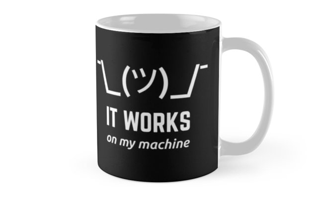

# Oficina sobre Docker

Objetivo: Um conteúdo prático sobre o que é Docker, como utilizar os comandos principais, Dockerfiles e docker-compose.

Os principais comandos utilizados ficarão salvos neste arquivo e poderão servir como uma "cola" para começar a montar seus próprios containers. 
Os Arquivos estarão disponíveis no [Github](https://github.com/Rede-DSBR/docker_oficina)


# Conteúdo

1. [Introdução](#Introdução)
2. [Hello Docker](#HelloDocker)
3. [Introdução](#Introdução)
4. [Introdução](#Introdução)


<div id='Introdução'/>

# Introdução



## Porque isto acontece ?

* Versões diferentes do compilador/interpretador
* Bibliotecas não instaladas ou diferentes versões
* Bibliotecas de sistema (dll's)
* Variáveis de Ambiente
* 100% Multiplataforma (?)


Usa o Kernel do sistema base.

Forma rápida e confiável de subir uma aplicação em vários lugares da mesma maneira sem precisar de uma iso do sistema todo.

Pode ser construído de forma simples com arquivos de texto (.yml e Dockerfile) e portanto podem ser versionados.

Possibilita atualizações automáticas e testes de integração (CI/CD)


<div id='HelloDocker'/>

# Hello Docker

Comandos feitos pelo terminal, com *docker* ou *docker-compose*

Ver, listar, acessar, criar, apagar imagens e containers.

[Documentação Docker](https://docs.docker.com/engine/reference/run/)

## Comandos Básicos

Listar containers, imagens e volumes

```Bash
$
```

Apagar uma imagem:

```Bash
$
```

## Rodando um container do repositório do Docker

[Repositórios de containers (dockerhub)](https://hub.docker.com/)

Simple server

https://hub.docker.com/r/docker/getting-started

```Bash
$ 
```

Python

```Bash
$
```

https://hub.docker.com/r/yeasy/simple-web/

```Bash
$
```

Algumas flags do [run](https://docs.docker.com/engine/reference/run/)

-it 
* i: Interactive
* t: TTY

--rm 
* r: Remove container after rum
* m: Remove container even if it is still running

--name:
Nome do seu container


## Acessar o terminal de um container:

```Bash
$
```


# Dockerfile

Arquivo *sem extensão* com nome Dockerfile por padrão (pode ter outros nomes, principalmente se existirem vários devido a docker-compose)

[Dockerfile reference](https://docs.docker.com/engine/reference/builder/)

Comandos para fazer um build

* FROM
* RUN
* COPY
* WORKDIR
* ENTRYPOINT
* CMD

## Criando um dockerfile para flask com ubuntu
Aplicação deverá usar ubuntu, instalar python, flask e rodar um servidor de aplicação entregando um html simples.

```Bash
$
```

# Docker Compose

Arquivo dockercompose.yml (nome pode ser alterado).

Formato yml (as vezes .yaml) e funciona como um json, porém formatado sem " e sem {}, apenas identação. Chave-valor que pode ser *nested*

As opções (flags) podem ser passadas dentro deste arquivo.

# Referências:

https://www.weave.works/blog/a-practical-guide-to-choosing-between-docker-containers-and-vms

https://docs.docker.com/engine/reference/commandline

https://docs.docker.com/compose/reference/
